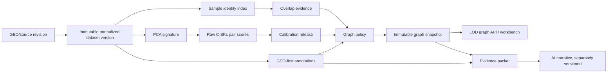
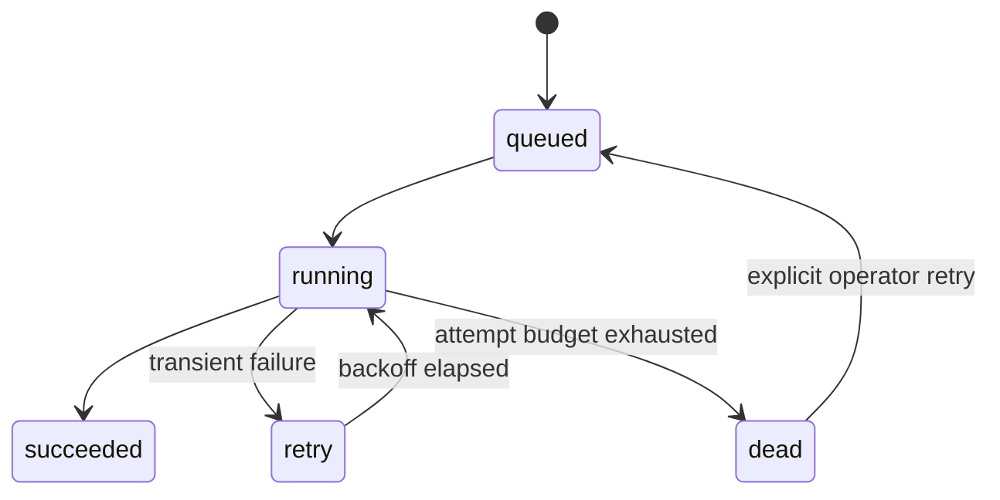

# Architecture

## Design objective

An update must do only work caused by new or changed inputs, retain enough
provenance to explain every reuse decision, and publish a graph atomically. Raw
scientific results, corpus-dependent inference, display policy, and generated
narrative are separate artifacts with separate lifetimes.



## The incremental boundary

Let N be the number of current datasets in one compatible stratum and K be the
new batch.

1. Normalize and sign each new immutable dataset version once.
2. Validate the complete feature universe, feature order, PCA dimension, alpha,
   and dependency fingerprint before scoring.
3. Stream K×N new-to-existing raw scores.
4. Stream K(K−1)/2 new-to-new scores when K > 1.
5. Never recompute N(N−1)/2 old-to-old raw scores unless their bound numerical
   dependency changes.
6. Persist bounded batches so memory is O(batch size), not O(N²).

This distinction matters: raw C-SKL is pair-local and appendable. Statistical
significance and BH-adjusted q-values are corpus-release results and may change
when the comparison family changes.

## Artifact dependency chain

Every reusable artifact has a canonical SHA-256 fingerprint over its direct
scientific dependencies:

```text
source revision + source bytes
  -> normalization config + ordered feature hash + QC policy
  -> signature algorithm/code + alpha + seed
  -> raw pair algorithm hash
  -> null pool + bootstrap/grid/profile parameters
  -> calibration release + multiple-testing family
  -> graph policy + layout/community version
```

The graph builder first computes the seeded Fruchterman-Reingold topology and
then applies a deterministic, aspect-aware collision projection. A spatial
hash keeps the local repulsion pass scalable; a weak anchor spring preserves
the topology while the release gate rejects layouts with severe node
collisions. The target spacing is derived from node count, so the same policy
is applied automatically whenever a new snapshot is built.

`fingerprints.py` canonicalizes values. `models.py` freezes manifests.
`artifact_store.py` writes private staging bundles, fsyncs payloads and
manifests, validates checksums and dependency contracts, then performs an atomic
directory publish. It rejects path escapes, unexpected files/directories, and
link-like entries.

## Storage boundaries

| Concern | Local/reference | Server target |
|---|---|---|
| Relational control plane | SQLite WAL | PostgreSQL |
| Matrices/signatures/null profiles | Content-addressed bundles | Object storage + Parquet |
| Raw pair values/calibration indexes | SQLite tables | Partitioned PostgreSQL/Parquet |
| Text embeddings | Optional files | pgvector or vector service |
| Serving snapshot | SQLite + manifest | Immutable object bundle + indexed API |
| Web UI | Static GitHub Pages showcase or vinext worker | Versioned API-backed deployment |

A graph database is intentionally not required for the first production
release. The primary workload is filtered sparse-neighborhood retrieval,
versioned release publication, and analytical queries that relational and
columnar stores handle well.

## Catalog and state transitions

`catalog.py` stores immutable dataset versions, samples, artifacts, raw scores,
overlap, calibration releases, snapshots, annotations, AI runs, and jobs.



Jobs have deterministic keys and input fingerprints. Re-enqueueing the same
work is idempotent. Failures retain error codes/details and exponential backoff
with jitter. Dead work is visible and can be requeued; it is never silently
treated as a permanently bad biological dataset.

## Calibration releases

- **Exact mode:** rebuilds the corpus-bound null/calibration family and rejects
  sample sizes outside the validated grid. This is the scientific reference.
- **Frozen mode:** reuses an explicitly named frozen operational calibration
  and permits documented boundary clamping. It supports predictable daily
  updates but is a distinct methodological variant.

Both modes write a new immutable release, run exact global BH correction in
disk-backed SQL, stage a graph snapshot, validate it, and atomically move the
stratum's current pointer. Readers see either the old complete snapshot or the
new complete snapshot—never a half-published graph.

## Serving and level of detail

The API returns a sparse, filtered view rather than shipping every possible pair:

- current snapshot by platform/feature stratum;
- nodes and edges under q/significance and independence policies;
- dataset and relationship detail on demand;
- curated query templates represented as a whitelisted AST;
- protected operations endpoints for retries.

The Canvas workbench renders the frozen 500-node release directly in the static
showcase. At multi-thousand-node scale the API remains the boundary: load a
community overview first, then fetch neighborhoods and evidence details. A WebGL
renderer can replace the view component without changing the scientific or API
contracts.

## Security and trust boundaries

- Raw SQL or executable query expressions are never accepted.
- Operations routes require a separate server-side token.
- OpenRouter keys stay server-side; model choice is explicit.
- AI inputs are size-bounded evidence packets with source IDs/hashes.
- AI results are stored as generated assertions/narratives, never merged into
  immutable GEO source fields.
- Published UI evidence always names its release and provenance state.
